# ABU Robocon 2026 — Computer Vision System

> **"Kung Fu Quest"** — ABU Asia-Pacific Robot Contest 2026, Hong Kong
>
> Two independent YOLOv8 vision subsystems built for Robot 2 (R2): real-time **Spearhead detection** during weapon assembly, and **Kung-Fu Scroll (KFS) classification** during autonomous Meihua Forest traversal.

---

## Table of Contents

1. [Competition Context](#1-competition-context)
2. [System Architecture](#2-system-architecture)
3. [Repository Structure](#3-repository-structure)
4. [Results](#4-results)
5. [Environment Setup](#5-environment-setup)
6. [Subsystem 1 — Spearhead Detection](#6-subsystem-1--spearhead-detection)
7. [Subsystem 2 — KFS Classification](#7-subsystem-2--kfs-classification)
8. [Automatic Annotation Pipeline](#8-automatic-annotation-pipeline)
9. [Pushing to GitHub from Ubuntu](#9-pushing-to-github-from-ubuntu)
10. [License](#10-license)

---

## 1. Competition Context

ABU Robocon 2026 "Kung Fu Quest" is a 3-minute match between two teams, each operating two robots — R1 (manual or automatic) and R2 (fully autonomous). The game field is divided into three zones:

**Zone 1 — Martial Club:** R1 picks up Staffs from its team's Staff Rack. R2 picks up one of six Spearheads from a shared central Spearhead Rack (three types, two of each) and assembles them with R1's Staff to form weapons. R2 must identify and navigate to the correct Spearhead type — this is where **Subsystem 1** operates.

**Zone 2 — Meihua Forest:** R2 autonomously navigates a 12-block grid, collecting **Real KFS** (game pieces marked with Oracle Bone Characters — 甲骨文) while never touching the **Fake KFS** (pieces marked with visually similar random patterns). Touching a Fake KFS is an immediate rule violation and forces a retry. R2 must classify each scroll it encounters on adjacent blocks — this is where **Subsystem 2** operates.

**Zone 3 — Arena:** R1 and R2 place collected KFS onto a 3×3 Tic-Tac-Toe rack. The first team to fill a vertical column or diagonal wins and is declared "Kung Fu Master".

The vision system in this repository covers both recognition tasks executed by R2.

---

## 2. System Architecture

```
┌─────────────────────────────────────────────────────────────────┐
│                        ABU Robocon 2026                         │
│                      Robot 2 (Autonomous)                       │
└──────────────────────────┬──────────────────────────────────────┘
                           │
           ┌───────────────┴───────────────┐
           │                               │
           ▼                               ▼
┌──────────────────────┐       ┌───────────────────────────┐
│  SUBSYSTEM 1         │       │  SUBSYSTEM 2              │
│  Spearhead Detection │       │  KFS Classification       │
│                      │       │                           │
│  Zone: Martial Club  │       │  Zone: Meihua Forest      │
│  Phase: Weapon       │       │  Phase: Scroll collection │
│         Assembly     │       │                           │
│  Model: YOLOv8s      │       │  Model: YOLOv8s           │
│  Classes: 3          │       │  (2-stage fine-tuned)     │
│  SPEAR / FIST / PALM │       │  Classes: 30              │
│                      │       │  REAL_1–15 / FAKE_1–15    │
│  conf=0.70, iou=0.70 │       │  conf=0.70, iou=0.40      │
│  imgsz=768           │       │  imgsz=800                │
└──────────────────────┘       └───────────────────────────┘
```

**Why two separate models instead of one unified model:**
The two tasks are visually unrelated and operate at different phases of the match. A single multi-task model would be harder to train, tune, and debug in isolation. Separate models allow independent iteration — improving KFS accuracy without risking spearhead detection stability, and vice versa. Each model can also be independently updated as the dataset grows without destabilizing the other.

---

## 3. Repository Structure

```
robocon2026-vision/
│
├── README.md
├── requirements.txt
├── .gitignore
│
├── spearhead/                      # Subsystem 1 — Weapon Assembly Vision
│   ├── data.yaml                   # Dataset config: SPEAR / FIST / PALM
│   ├── train.py                    # YOLOv8s training script
│   ├── detect.py                   # Real-time webcam inference
│   ├── annotate.py                 # Auto-annotation script for CVAT
│   ├── weights/
│   │   └── best.pt                 # Trained weights (22MB)
│   └── results/                    # Training metrics and sample outputs
│       ├── results.png
│       ├── confusion_matrix.png
│       ├── confusion_matrix_normalized.png
│       ├── BoxPR_curve.png
│       ├── BoxP_curve.png
│       ├── BoxR_curve.png
│       ├── BoxF1_curve.png
│       └── val_batch*.jpg
│
├── kfs/                            # Subsystem 2 — KFS Classification Vision
│   ├── data.yaml                   # Dataset config: 30 classes
│   ├── train_initial.py            # Stage 1: Train from YOLOv8s pretrained backbone
│   ├── train_finetune.py           # Stage 2: Fine-tune from Stage 1 checkpoint
│   ├── detect.py                   # Basic real-time inference
│   ├── detect_stable.py            # Inference with temporal smoothing (majority vote)
│   ├── detect_dualmode.py          # Dual-mode: YOLO + HSV blue square detection
│   ├── weights/
│   │   └── best.pt                 # Trained weights (22MB)
│   └── results/                    # Training metrics and sample outputs
│       ├── results.png
│       ├── confusion_matrix.png
│       └── ...
│
└── docs/
    └── annotation_pipeline.md      # Detailed CVAT annotation issue log
```

**What is NOT in this repository:**
- Raw image datasets (`Creating_data/`, `Merged_Dataset/`) — too large for Git; collect locally
- Virtual environment (`.venv/`)
- Intermediate YOLO prediction runs (`runs/detect/fist_pred/` etc.)
- Experimental training scripts (`train_8m_1.py`, `train_8m_2.py`, `train_vm.py`)
- Dataset zip archives

---

## 4. Results

### Spearhead Detection

| Metric | Plot |
|--------|------|
| Training curves | 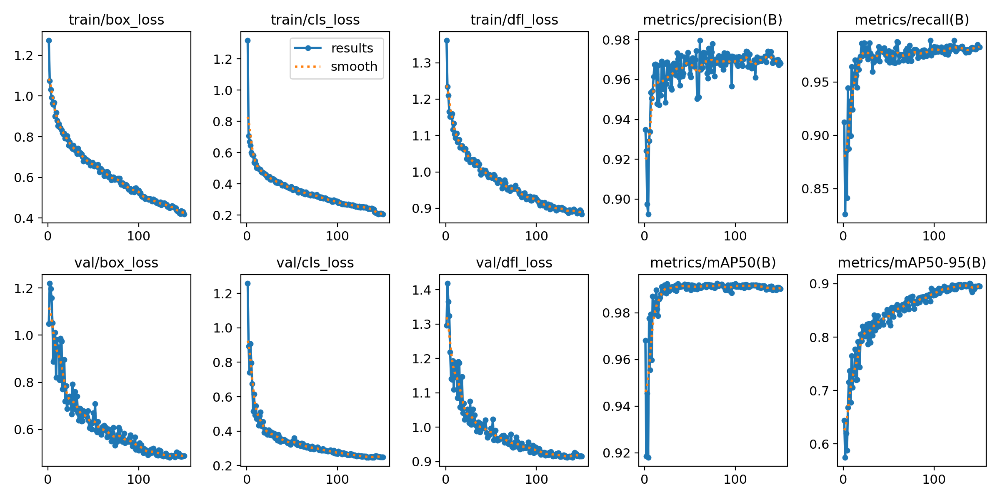 |
| Confusion Matrix | 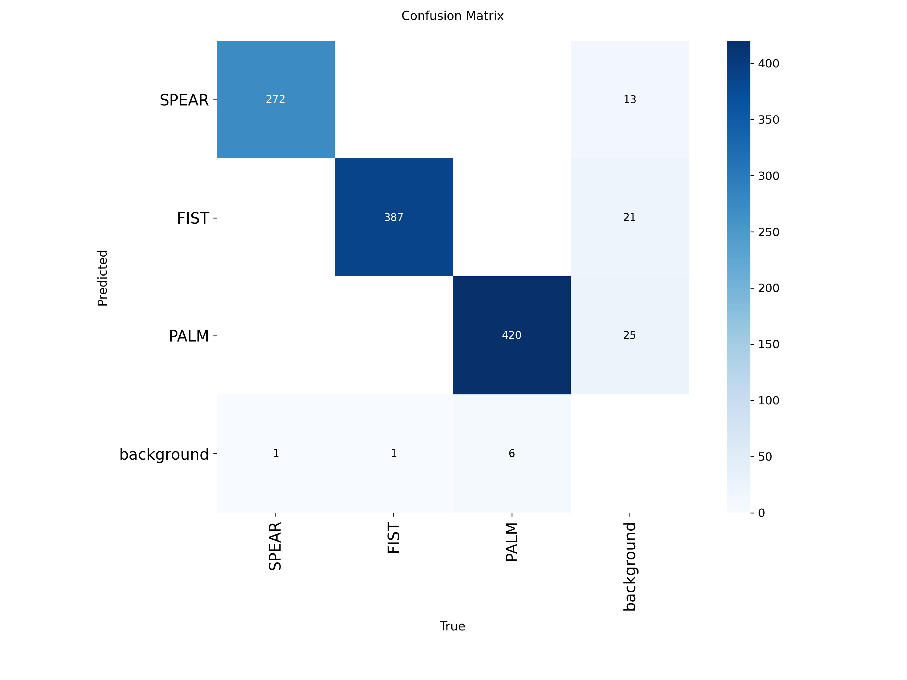 |
| PR Curve | 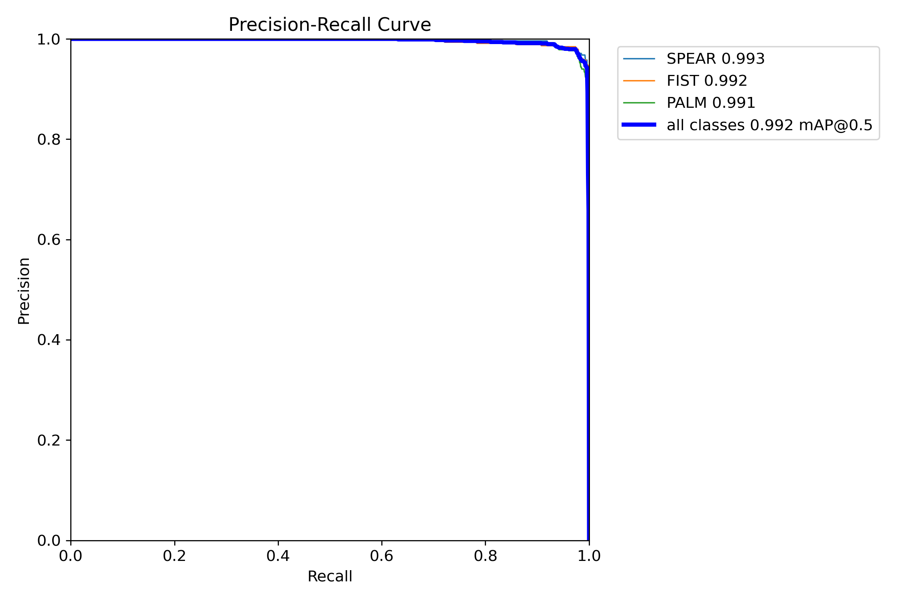 |
| F1 Curve | 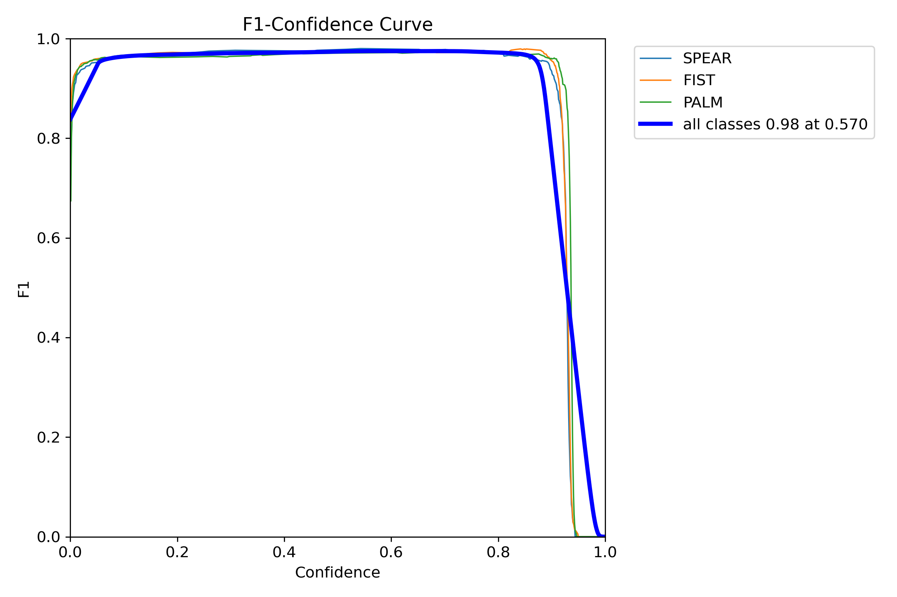 |

| Ground Truth | Predictions |
|-------------|-------------|
| 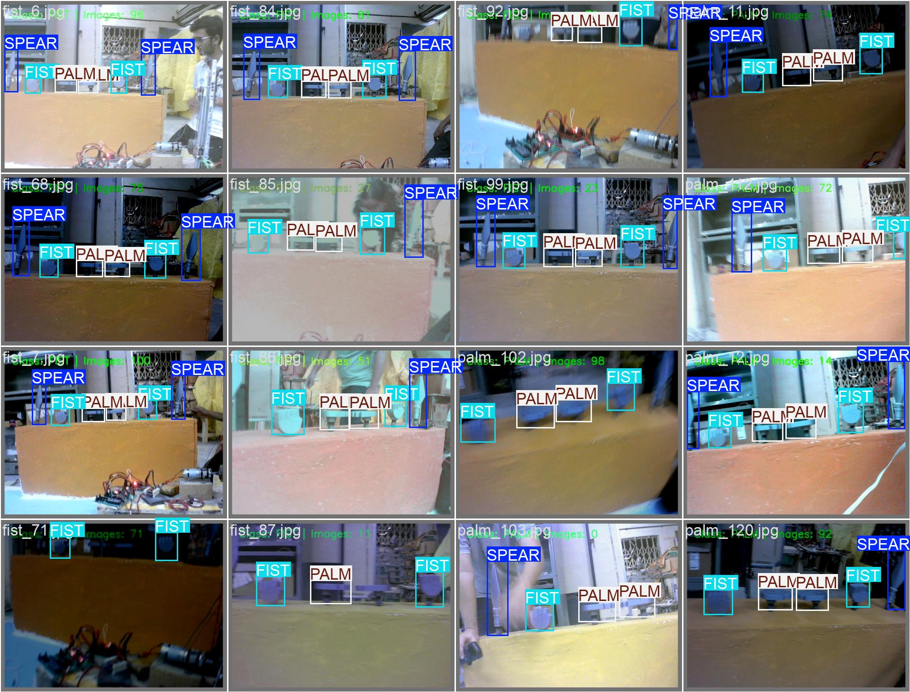 | 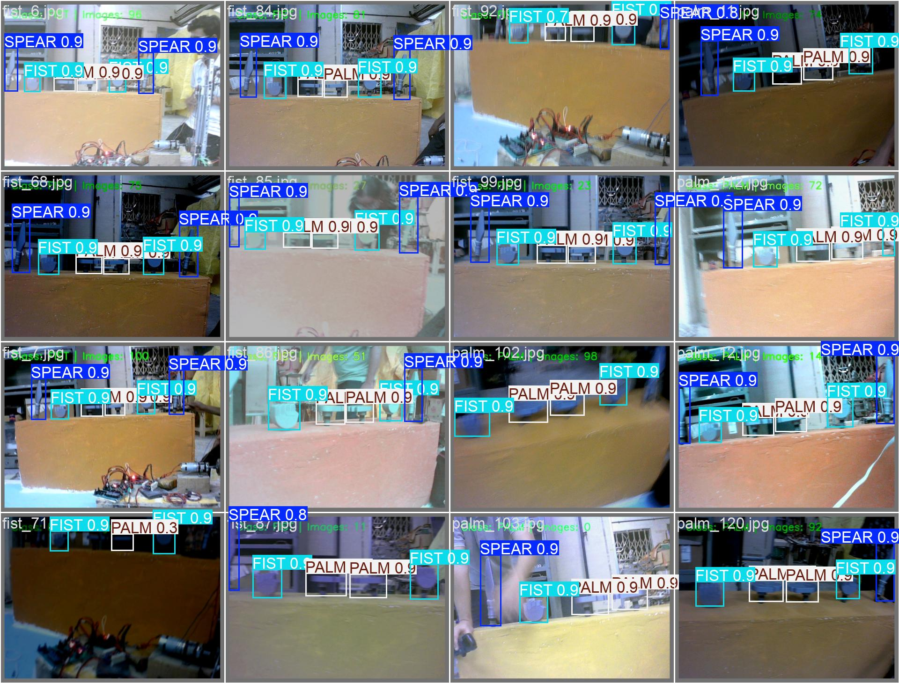 |

### KFS Classification

| Metric | Plot |
|--------|------|
| Training curves | 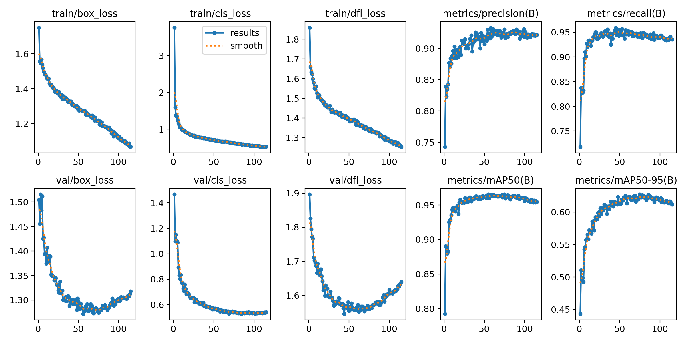 |
| Confusion Matrix | 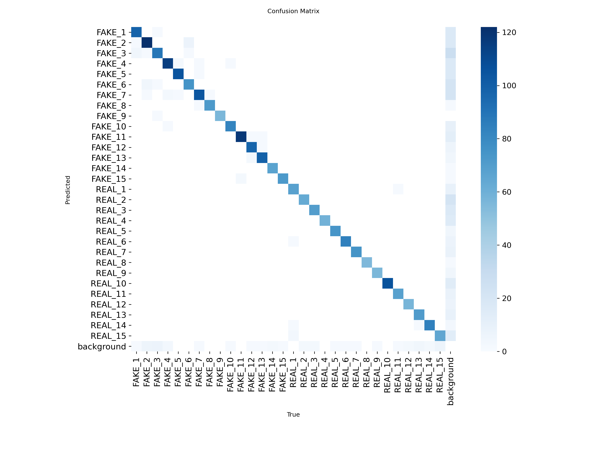 |
| PR Curve | 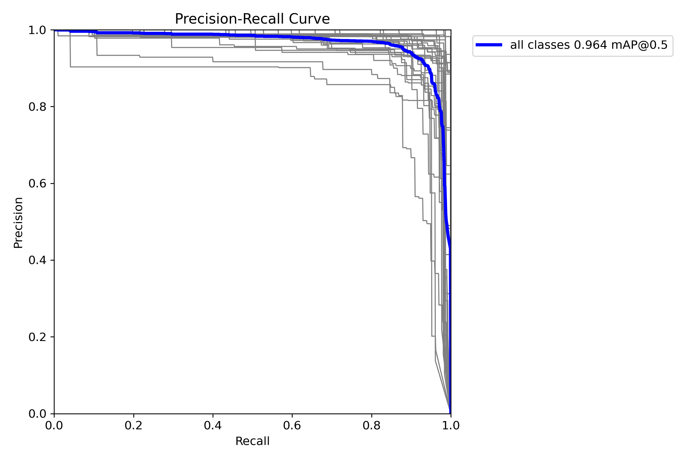 |
| F1 Curve | 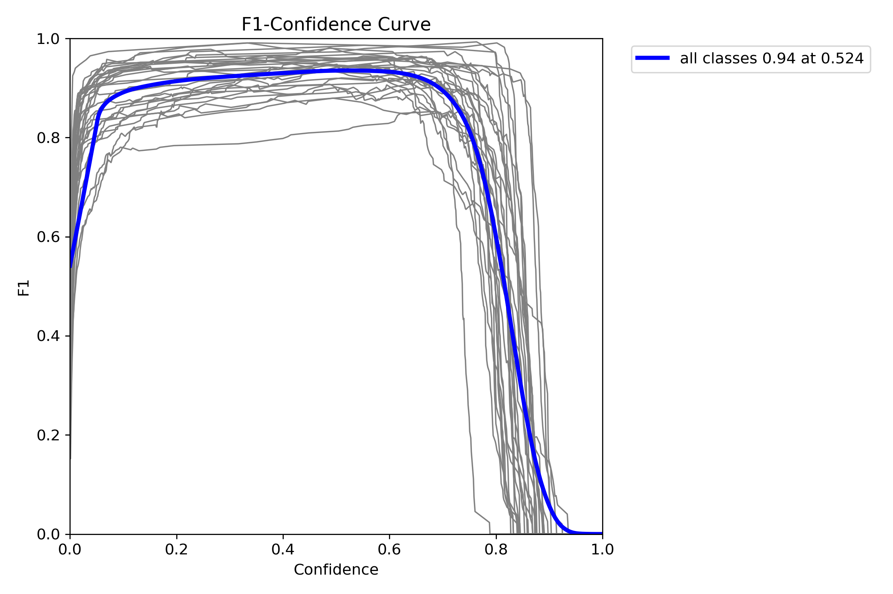 |

| Ground Truth | Predictions |
|-------------|-------------|
| 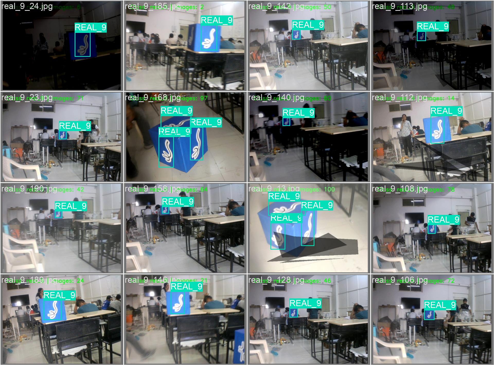 | 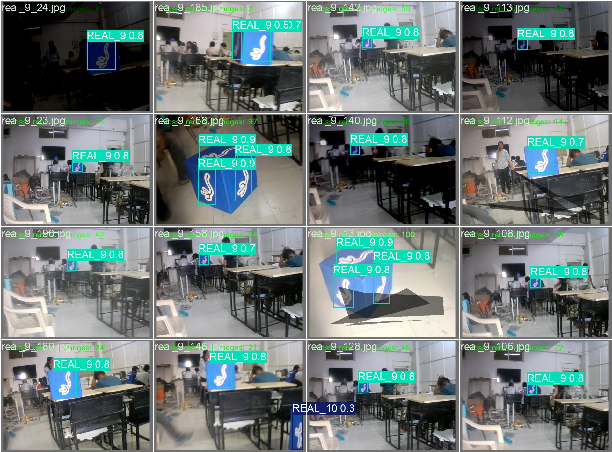 |

---

## 5. Environment Setup

### Prerequisites

- Ubuntu 20.04 / 22.04 / 24.04
- Python 3.10 or 3.11
- NVIDIA GPU with CUDA (required for training; strongly recommended for real-time inference)
- CUDA 11.8 or 12.1 installed on the system

### Verify GPU and CUDA

```bash
nvidia-smi        # must show your GPU and driver version
nvcc --version    # must show CUDA toolkit version
```

If `nvidia-smi` fails, your NVIDIA drivers are not installed. Training on CPU is not practical for these dataset sizes — install GPU drivers before proceeding.

### Clone the repository

```bash
git clone https://github.com/pratham0912/robocon2026-vision.git
cd robocon2026-vision
```

### Create and activate a virtual environment

Python's built-in `venv` is used here. Do not install project dependencies into the system Python — it will conflict with system packages.

```bash
python3 -m venv .venv
source .venv/bin/activate
```

The `(.venv)` prefix will appear in your terminal prompt after activation. Every time you open a new terminal to work on this project, run `source .venv/bin/activate` again before executing any scripts.

### Install dependencies

```bash
pip install --upgrade pip
pip install -r requirements.txt
```

### Install PyTorch with CUDA

`requirements.txt` installs the CPU build of PyTorch by default. Replace it with the CUDA build matching your system:

**CUDA 11.8:**
```bash
pip install torch torchvision --index-url https://download.pytorch.org/whl/cu118
```

**CUDA 12.1:**
```bash
pip install torch torchvision --index-url https://download.pytorch.org/whl/cu121
```

**Verify GPU is visible to PyTorch:**
```bash
python3 -c "import torch; print(torch.cuda.is_available()); print(torch.cuda.get_device_name(0))"
```

This must print `True` followed by your GPU name. If it prints `False`, the PyTorch CUDA version does not match the installed CUDA toolkit — reinstall using the correct index URL above.

---

## 6. Subsystem 1 — Spearhead Detection

### Task Definition

The shared Spearhead Rack at the centre of the field holds six Spearheads — three types, two of each. R2 must identify which Spearhead type is accessible and navigate to pick it up before assembling it with R1's Staff. This model classifies the three spearhead types from a live camera feed.

**Classes:**

| Class ID | Name | Description |
|----------|------|-------------|
| 0 | SPEAR | Index finger extended forward |
| 1 | FIST | Closed fist |
| 2 | PALM | Open hand, all fingers extended |

### Dataset Preparation

Images were collected per class (~400 per class), renamed with class prefixes, annotated in CVAT using the semi-automatic pipeline described in [Section 8](#8-automatic-annotation-pipeline), and split 80/20 into train/val.

Dataset structure expected by `data.yaml`:

```
spearhead_full/
├── train/
│   ├── images/    ← .jpg files
│   └── labels/    ← .txt files (YOLO format)
└── val/
    ├── images/
    └── labels/
```

### Training

```bash
cd spearhead
python3 train.py
```

**Hyperparameter decisions:**

| Parameter | Value | Rationale |
|-----------|-------|-----------|
| `model` | YOLOv8s | Sufficient for 3-class detection at real-time speed |
| `epochs` | 150 | With patience=40, stops early if mAP plateaus |
| `imgsz` | 768 | Larger than default 640 — better detection of hand regions in frame |
| `optimizer` | AdamW | Better generalization than SGD on small custom datasets |
| `lr0` | 0.003 | Initial LR with cosine annealing schedule (`cos_lr=True`) |
| `mosaic` | 1.0 | Combines 4 images per training sample — helps positional invariance |
| `amp` | True | Automatic Mixed Precision — reduces VRAM, speeds up training |
| `device` | 0 | First CUDA GPU — change to `cpu` to force CPU (not recommended) |
| `workers` | 12 | Dataloader threads — reduce if your CPU has fewer cores |

Output is saved to `SPEARHEAD_FULL/spearhead_train/`. Copy `weights/best.pt` to `spearhead/weights/best.pt`.

**Resume interrupted training:**

```bash
python3 - <<'EOF'
from ultralytics import YOLO
model = YOLO("SPEARHEAD_FULL/spearhead_train/weights/last.pt")
model.train(resume=True)
EOF
```

### Inference

```bash
cd spearhead
python3 detect.py
```

Opens the webcam at device index `0` and displays live bounding boxes. Press `q` to quit.

**Inference parameters:**

| Parameter | Value | Effect |
|-----------|-------|--------|
| `conf` | 0.70 | High threshold — suppresses false positives in a live camera feed |
| `iou` | 0.70 | NMS threshold — reduces overlapping duplicate detections |
| `imgsz` | 768 | Must match the image size used during training |
| `stream` | True | Generator mode — processes frames one at a time without memory accumulation |

---

## 7. Subsystem 2 — KFS Classification

### Task Definition

R2 must navigate the Meihua Forest (a 12-block grid at three height levels — 200mm, 400mm, 600mm) and collect Real KFS while never touching Fake KFS. Per the rulebook, each team's forest contains:

- 3 R1 KFS (Robocon logo) — collected by R1 from the Pathway, not relevant to this model
- 4 R2 KFS (Oracle Bone Characters) — R2 must collect these
- 1 Fake KFS (random patterns) — R2 must identify and avoid this

Touching the Fake KFS triggers an immediate forced retry (Rule 8.9). This model classifies all 30 possible symbols from a live camera feed so R2 knows whether to pick up or skip each scroll.

### Dataset and Classes

**30 classes total:**

| Class IDs | Category | Description |
|-----------|----------|-------------|
| 0–14 | `FAKE_1` to `FAKE_15` | Random pattern scrolls — must never be collected |
| 15–29 | `REAL_1` to `REAL_15` | Oracle Bone Character scrolls — must be collected |

The 15 Real and 15 Fake characters are defined in the official rulebook (Section 16). Both sets use a similar archaic brush-stroke visual style, making the classification task genuinely challenging — the model cannot rely on gross shape differences.

**Why 30 individual classes rather than binary Real/Fake:** Per-character training forces the model to learn fine-grained stroke-level differences between all 30 symbols, producing richer gradient signal. A binary classifier would learn only a coarse Real/Fake boundary and would be more likely to confuse visually similar characters from opposing categories.

### Training Pipeline

KFS training used a deliberate two-stage approach. Training directly to a final model risks overfitting or getting stuck in poor local minima. The first stage establishes a strong initial representation; the second stage refines it with adjusted hyperparameters.

#### Stage 1 — Initial Training

```bash
cd kfs
python3 train_initial.py
```

Trains YOLOv8s from the pretrained `yolov8s.pt` ImageNet backbone on the full 30-class `Merged_Dataset`. Output: `FAKE_KFS_TRAINING_2/exp_yolov8s_best/`.

**Stage 1 hyperparameter decisions:**

| Parameter | Value | Rationale |
|-----------|-------|-----------|
| `model` | YOLOv8s | Establish baseline before considering larger models |
| `epochs` | 300 | Long run with patience=30 — allow full exploration |
| `imgsz` | 800 | High resolution is critical for fine-grained stroke recognition |
| `optimizer` | SGD | Better generalization over long training runs |
| `mosaic` | 1.0 | Full mosaic augmentation |
| `mixup` | 0.1 | Slight mixup — softens decision boundaries between similar classes |

#### Stage 2 — Fine-tuning

```bash
cd kfs
python3 train_finetune.py
```

Loads the best Stage 1 checkpoint and continues training with adjusted hyperparameters. Output: `FULL_KFS_TRAINING/kfs_v8_fine_tuned/`. The final best weights are at `FULL_KFS_TRAINING/best_model_kfs/weights/best.pt`.

**Key differences in Stage 2 vs Stage 1:**

| Parameter | Stage 1 | Stage 2 | Reason |
|-----------|---------|---------|--------|
| `lr0` | 0.01 | 0.005 | Lower LR for fine-tuning — avoid overwriting learned features |
| `patience` | 30 | 50 | Fine-tuning converges slower — needs more patience |
| `copy_paste` | not set | 0.2 | Additional augmentation for small object generalization |
| `perspective` | not set | 0.0005 | Simulate slight camera tilt — scrolls may not be perfectly flat-on |
| `degrees` | not set | 5.0 | Small rotation — scrolls may be slightly tilted in the forest |
| `dropout` | not set | 0.0 | Explicitly disabled — fine-tuning benefits from full capacity |

### Inference Modes

Three inference scripts are provided, each building additional robustness on top of the previous.

#### `detect.py` — Basic inference

```bash
cd kfs
python3 detect.py
```

Single-frame inference. Every frame is independently classified. Use this to verify the model loads and detects correctly during initial testing.

```
source=1, conf=0.70, iou=0.40, imgsz=800
```

`source=1` targets camera device index 1 — the camera physically mounted on R2 for forest navigation, separate from any camera used by R1 or the operator. Change to `source=0` if testing with a single webcam.

#### `detect_stable.py` — Temporal smoothing

```bash
cd kfs
python3 detect_stable.py
```

Adds a sliding window majority vote over the last 5 frames. A detection is only displayed if the same class appears in at least 3 of the last 5 frames.

**Why this matters:** During R2's movement between forest blocks, the camera feed is subject to motion blur and partial occlusion. Single-frame classifications during motion are unreliable. The temporal buffer ensures R2 only acts on stable, consistent detections — preventing it from reacting to transient misclassifications caused by motion artefacts.

```python
history = deque(maxlen=5)
most_common = Counter(history).most_common(1)[0][0]
if history.count(most_common) >= 3:   # stable for at least 3 of last 5 frames
    display_frame = r.plot()
```

Additional flags: `augment=True` (Test Time Augmentation), `max_det=20`.

#### `detect_dualmode.py` — Dual-mode detection

```bash
cd kfs
python3 detect_dualmode.py
```

Combines two detection modes in a single runtime session, switchable with keyboard keys:

**Mode 1 — YOLO KFS classification (press `1`):**
Same stable majority-vote inference as `detect_stable.py`. Used when R2 has reached a block and needs to classify the scroll in front of it.

**Mode 2 — Blue square detection (press `2`):**
HSV-based contour detection targeting blue quadrilateral shapes. Detects 4-sided contours with near-square aspect ratio (0.85–1.15) above a minimum area threshold. The blue target range:

```python
lower_blue = np.array([90, 100, 70])
upper_blue = np.array([140, 255, 255])
```

Per the official rulebook Section 15, the Meihua Forest Zone 2 Pathway for the blue team is painted RGB 128-191-209 and the blue Start Zone is RGB 50-0-255. This mode is used for R2 positional navigation — detecting blue zone boundary markers to confirm R2 has reached the correct block position before attempting KFS classification and pickup.

**Keyboard controls:**

| Key | Action |
|-----|--------|
| `1` | Switch to YOLO KFS classification |
| `2` | Switch to blue square navigation detection |
| `q` | Quit |

---

## 8. Automatic Annotation Pipeline

This section documents the semi-automatic annotation pipeline used to label the Spearhead dataset. The same workflow applies to any future KFS dataset expansion.

### 8.1 Pipeline Overview

```
Collect raw images per class
            │
            ▼
Rename images with class prefix
(prevents filename collisions — see Issue 3)
            │
            ▼
Label ~20–50 images manually in CVAT
            │
            ▼
Train initial YOLOv8 model → best.pt
            │
            ▼
Run annotate.py
→ YOLO predicts bounding boxes on all images
→ Saves .txt label files
            │
            ▼
Strip confidence column from .txt files
(CVAT requires exactly 5 values per line — see Issue 4)
            │
            ▼
cd combined_labels && zip -r ../labels.zip *.txt
            │
            ▼
Import labels.zip into CVAT
(Actions → Upload annotations → Format: YOLO 1.1)
            │
            ▼
Manually correct wrong/missed detections
            │
            ▼
Export corrected dataset → Re-train final model
```

This pipeline reduces total manual annotation effort by approximately 80–90%.

### 8.2 Step-by-Step

#### Step 1 — Rename images

```python
import os

base = "Creating_data/SPEARHEAD_DATA"

for folder in ["FIST", "PALM", "SPEAR"]:
    path = os.path.join(base, folder)
    files = sorted([f for f in os.listdir(path) if f.lower().endswith((".jpg", ".png", ".jpeg"))])
    for i, filename in enumerate(files):
        ext = os.path.splitext(filename)[1]
        new_name = f"{folder.lower()}_{i}{ext}"
        os.rename(os.path.join(path, filename), os.path.join(path, new_name))
```

#### Step 2 — Upload to CVAT and define labels

Create a task at [app.cvat.ai](https://app.cvat.ai). Upload images in a flat structure. Define labels in this exact order to match `data.yaml`:

```
SPEAR  (class 0)
FIST   (class 1)
PALM   (class 2)
```

#### Step 3 — Run annotation

```bash
cd spearhead
python3 annotate.py
```

Output saved to:
```
runs/detect/fist_pred/labels/
runs/detect/palm_pred/labels/
runs/detect/spear_pred/labels/
```

#### Step 4 — Combine labels

```bash
mkdir -p combined_labels
cp runs/detect/fist_pred/labels/*.txt combined_labels/
cp runs/detect/palm_pred/labels/*.txt combined_labels/
cp runs/detect/spear_pred/labels/*.txt combined_labels/
```

#### Step 5 — Strip confidence column

```bash
cd combined_labels
for f in *.txt; do awk '{print $1,$2,$3,$4,$5}' "$f" > tmp && mv tmp "$f"; done
cd ..
```

#### Step 6 — Create import ZIP

```bash
cd combined_labels
zip -r ../labels.zip *.txt
```

Verify:
```bash
unzip -l ../labels.zip | head
# Must show .txt at root, NOT inside a subdirectory
```

#### Step 7 — Import into CVAT

Actions → Upload annotations → **Format: YOLO 1.1** → Upload `labels.zip` → OK.

#### Step 8 — Correct and export

Review all frames. Correct wrong or missed detections manually. Export via Actions → Export dataset → YOLO 1.1. Restructure into `train/` and `val/` as required by `data.yaml`.

---

### 8.3 Issues Encountered and How They Were Fixed

#### Issue 1 — `FileNotFoundError: No images found`

**Error:**
```
FileNotFoundError: No images or videos found in Creating_data/SPEARHEAD_DATA
```

**Root cause:** `model.predict()` does not recursively scan subdirectories in some Ultralytics versions. Passing the parent folder as source fails because images are inside class subfolders.

**Fix:** Pass each class subfolder individually as the source in a loop with unique `name` per call.

---

#### Issue 2 — Labels from earlier class folders overwritten

**Symptom:** After running prediction on all three class folders, only the last folder's labels existed.

**Root cause:** `model.predict()` defaults to writing all output to `runs/detect/predict/`. Every call without a unique `name` writes to the same path.

**Fix:**
```python
model.predict(source=folder, project="runs/detect", name="fist_pred")
model.predict(source=folder, project="runs/detect", name="palm_pred")
model.predict(source=folder, project="runs/detect", name="spear_pred")
```

---

#### Issue 3 — Filename collisions when combining labels from three folders

**Symptom:** `combined_labels/` contained ~400 files instead of ~1200 after copying from all three folders.

**Root cause:** All three class folders had identically numbered images (`0.jpg`, `1.jpg`, etc.) producing identical label filenames.

**Fix:** Rename images with a class prefix before running any prediction. See Step 1 above.

---

#### Issue 4 — CVAT import fails with `datumaro._ImportFail`

**Error:**
```
datumaro.components.contexts.importer._ImportFail:
Failed to import dataset 'yolo'
```

**Root cause:** Every annotation line had six values instead of the required five:

```
# What was generated (wrong — 6 values):
0 0.699021 0.474084 0.0717145 0.256695 0.735146

# What CVAT requires (correct — 5 values):
0 0.699021 0.474084 0.0717145 0.256695
```

The sixth value is the confidence score, added because `save_conf=True` was used in the prediction call. CVAT's Datumaro importer strictly requires exactly 5 space-separated values per line. Any deviation causes a complete import failure. The error message is generic and does not indicate the column count mismatch — this took significant time to diagnose.

**Fix:** Remove `save_conf=True` from all prediction calls. `annotate.py` in this repository does not use it. If labels were already generated with confidence scores, strip them:

```bash
cd combined_labels
for f in *.txt; do awk '{print $1,$2,$3,$4,$5}' "$f" > tmp && mv tmp "$f"; done
```

---

#### Issue 5 — ZIP structure rejected by CVAT

**Root cause:** ZIP created from a parent directory produces nested paths (`combined_labels/fist_0.txt`). CVAT YOLO 1.1 requires `.txt` files at the ZIP root, not nested inside any folder.

**Fix:**
```bash
# Correct:
cd combined_labels && zip -r ../labels.zip *.txt

# Wrong:
zip -r labels.zip combined_labels/
```

---

## 9. Pushing to GitHub from Ubuntu

Three methods are provided. All three produce the same result — a public repository at `https://github.com/pratham0912/robocon2026-vision`. SSH is recommended for regular development; HTTPS is the simplest starting point.

### Prerequisites

**Install Git:**
```bash
sudo apt update && sudo apt install git -y
git --version
```

**Set identity (required for every commit):**
```bash
git config --global user.name "Your Name"
git config --global user.email "your@email.com"
```

Use the same email as your GitHub account.

**Create the GitHub repository:**

Go to [github.com/new](https://github.com/new):
- Name: `robocon2026-vision`
- Visibility: Public
- **Do NOT initialize with README, .gitignore, or license** — you are pushing an existing repo
- Click **Create repository**

---

### Method 1 — HTTPS with Personal Access Token

GitHub does not accept your account password for Git operations over HTTPS. A Personal Access Token (PAT) is required.

**Generate a PAT:**
1. Go to [github.com → Settings → Developer settings → Personal access tokens → Tokens (classic)](https://github.com/settings/tokens)
2. Click **Generate new token (classic)**
3. Set a name, expiration, and check the **repo** scope
4. Click **Generate token** — copy it immediately, it will not be shown again

**Initialize and push:**
```bash
cd ~/robocon2026-vision   # or wherever setup_repo.sh placed your repo
git init
git add .
git commit -m "Initial commit: Robocon 2026 vision — spearhead and KFS detection"
git branch -M main
git remote add origin https://github.com/pratham0912/robocon2026-vision.git
git push -u origin main
```

When prompted for a password, paste the PAT — not your GitHub account password.

**Cache credentials:**
```bash
git config --global credential.helper store
```

After the next push, credentials are saved to `~/.git-credentials` and you will not be prompted again on this machine.

---

### Method 2 — SSH (recommended for regular use)

SSH uses a key pair — the public key lives on GitHub, the private key stays on your machine. No passwords or tokens required after initial setup.

**Generate a key pair:**
```bash
ssh-keygen -t ed25519 -C "your@email.com"
```
Accept the default path (`~/.ssh/id_ed25519`). Set a passphrase or leave empty.

**Copy the public key to GitHub:**
```bash
cat ~/.ssh/id_ed25519.pub
```
Go to [github.com → Settings → SSH and GPG keys → New SSH key](https://github.com/settings/keys). Paste the output. Click **Add SSH key**.

**Test the connection:**
```bash
ssh -T git@github.com
# Expected: Hi pratham0912! You've successfully authenticated...
```

If prompted about host fingerprint on first connection, type `yes`.

**Initialize and push:**
```bash
cd ~/robocon2026-vision
git init
git add .
git commit -m "Initial commit: Robocon 2026 vision — spearhead and KFS detection"
git branch -M main
git remote add origin git@github.com:pratham0912/robocon2026-vision.git
git push -u origin main
```

No credential prompt — SSH handles authentication silently.

---

### Method 3 — GitHub CLI

**Install:**
```bash
curl -fsSL https://cli.github.com/packages/githubcli-archive-keyring.gpg | sudo dd of=/usr/share/keyrings/githubcli-archive-keyring.gpg
echo "deb [arch=$(dpkg --print-architecture) signed-by=/usr/share/keyrings/githubcli-archive-keyring.gpg] https://cli.github.com/packages stable main" | sudo tee /etc/apt/sources.list.d/github-cli.list > /dev/null
sudo apt update && sudo apt install gh -y
```

**Authenticate:**
```bash
gh auth login
```
Follow the prompts: select GitHub.com, HTTPS or SSH, login with browser. Copy the one-time code shown in terminal, paste it in the browser, authorize.

**Create repo and push in one command:**
```bash
cd ~/robocon2026-vision
git init
git add .
git commit -m "Initial commit: Robocon 2026 vision — spearhead and KFS detection"
git branch -M main
gh repo create robocon2026-vision \
  --public \
  --description "YOLOv8 vision system for ABU Robocon 2026 — Spearhead detection and KFS classification" \
  --source=. \
  --remote=origin \
  --push
```

Creates the GitHub repository and pushes in one step without visiting the browser for repo creation.

---

### Subsequent pushes

```bash
git status                            # see what changed
git add .                             # stage all changes, or specify files
git commit -m "your message here"     # commit with a descriptive message
git push                              # push to GitHub
```

---

## 10. License

MIT License — free to use, modify, and distribute with attribution.

---

*Built by [pratham0912](https://github.com/pratham0912) — ABU Robocon 2026, "Kung Fu Quest", Hong Kong*
