# Training Results

Full training metrics, confusion matrices, precision-recall curves, and sample validation predictions for both vision subsystems.

---

## Subsystem 1 — Spearhead Detection

**Model:** YOLOv8s | **Classes:** SPEAR, FIST, PALM | **Epochs:** 150 (patience=40) | **imgsz:** 768

### Training Curves

### Confusion Matrix

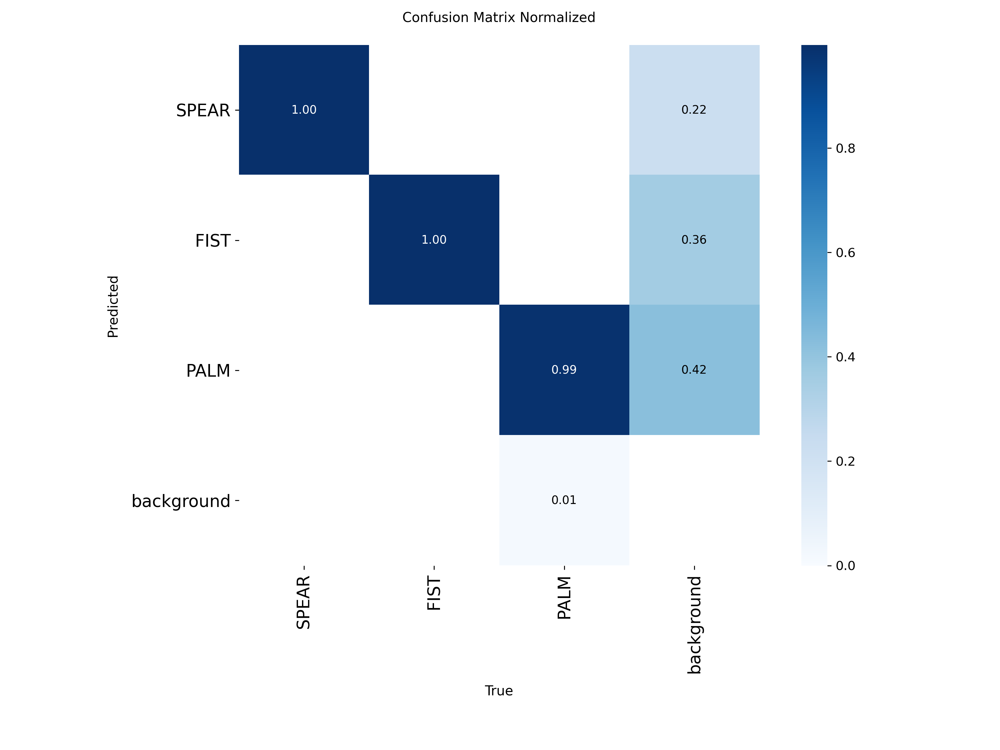

### Precision, Recall, and F1 Curves

| Curve | Plot |
|-------|------|
| Precision-Recall |  |
| Precision | 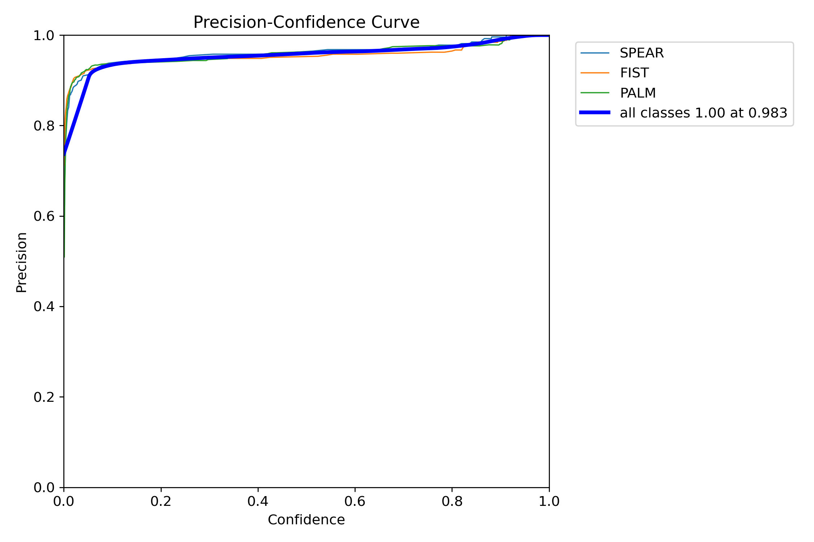 |
| Recall | 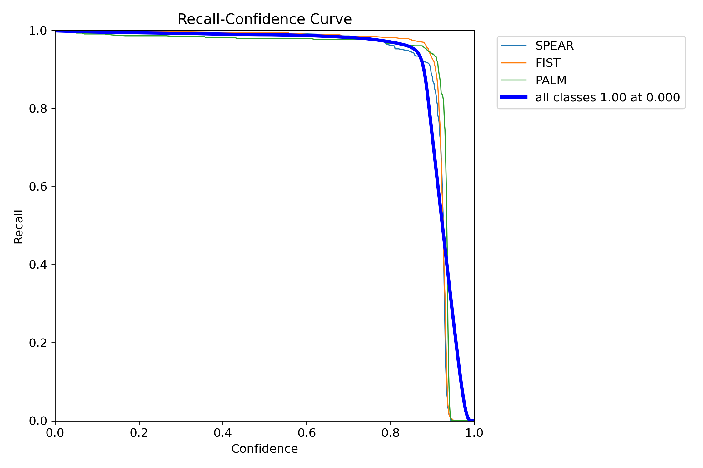 |
| F1 |  |

### Sample Validation Predictions

| Batch | Ground Truth | Predictions |
|-------|-------------|-------------|
| 0 |  |  |
| 1 | 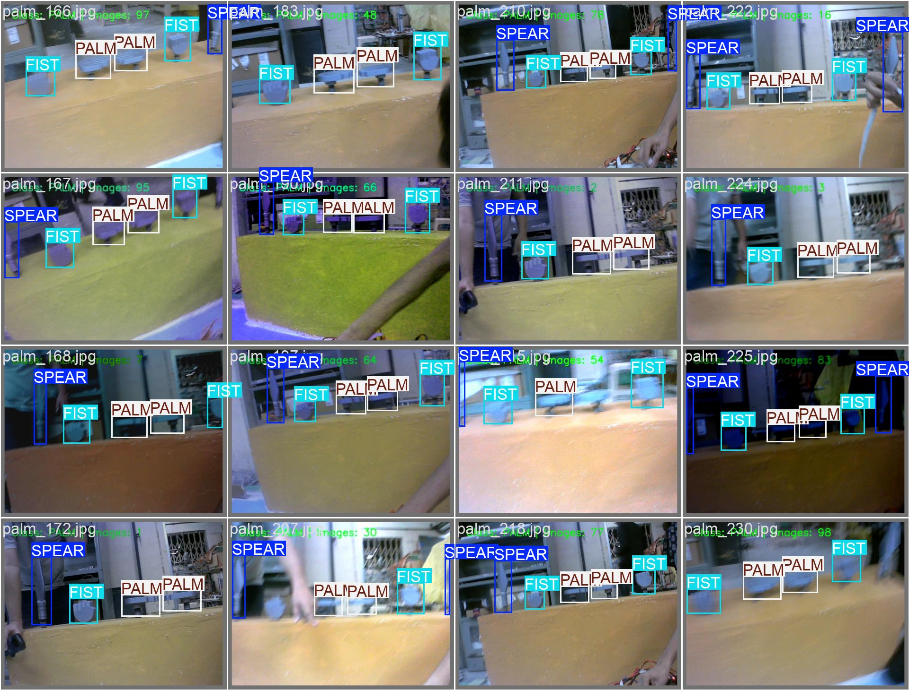 | 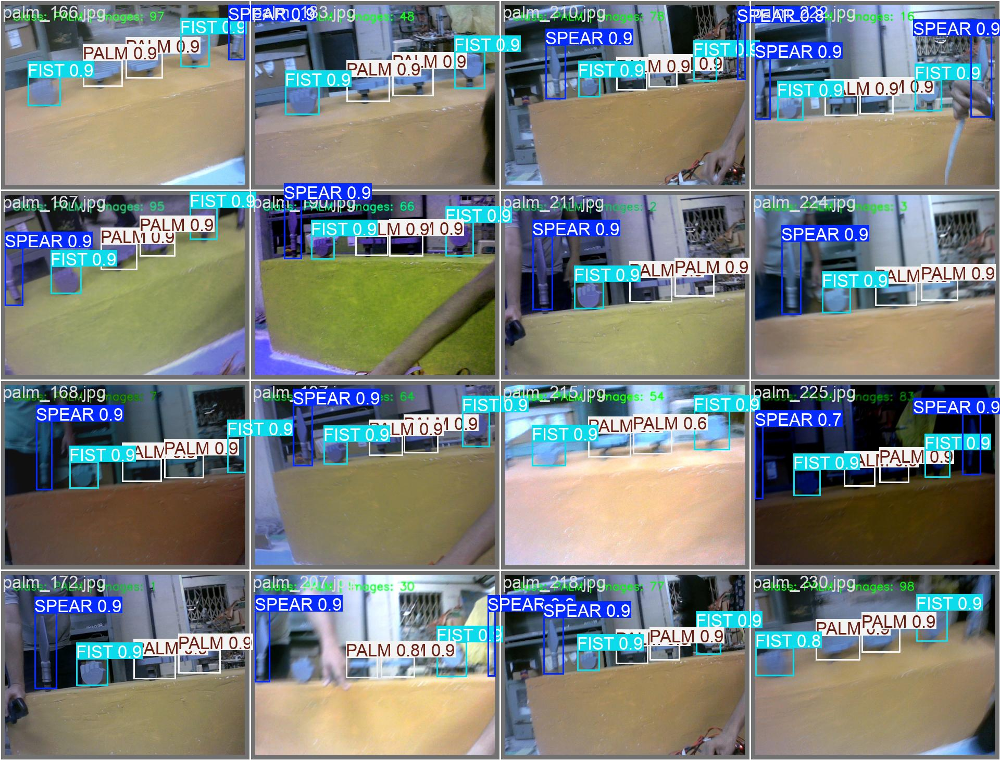 |
| 2 | 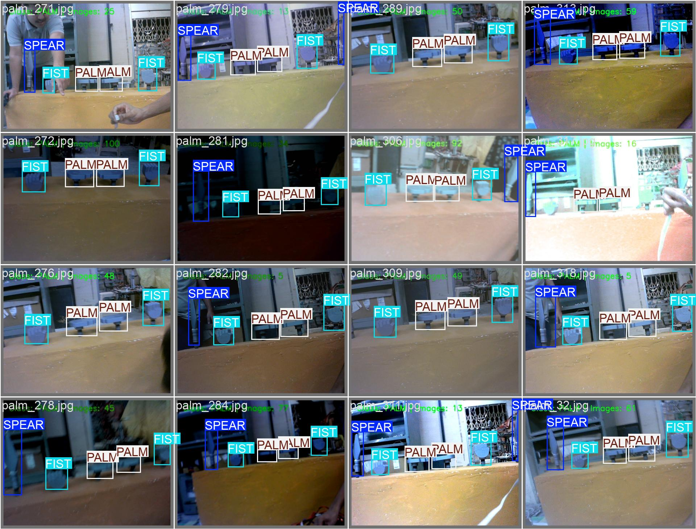 | 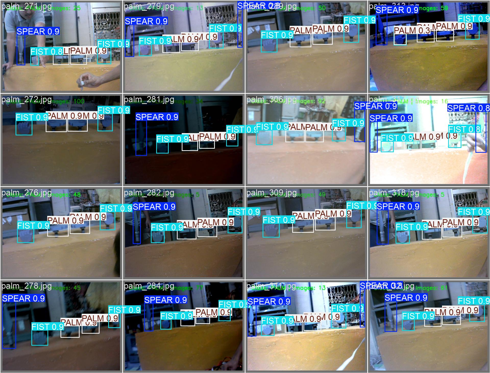 |

---

## Subsystem 2 — KFS Classification

**Model:** YOLOv8s (2-stage fine-tuned) | **Classes:** 30 (REAL_1–15, FAKE_1–15) | **imgsz:** 800

Training used a two-stage pipeline: initial training from the pretrained YOLOv8s backbone (300 epochs, SGD), followed by fine-tuning from the Stage 1 best checkpoint (200 epochs, lower LR, additional augmentation). The results below are from the final fine-tuned model.

### Training Curves

### Confusion Matrix

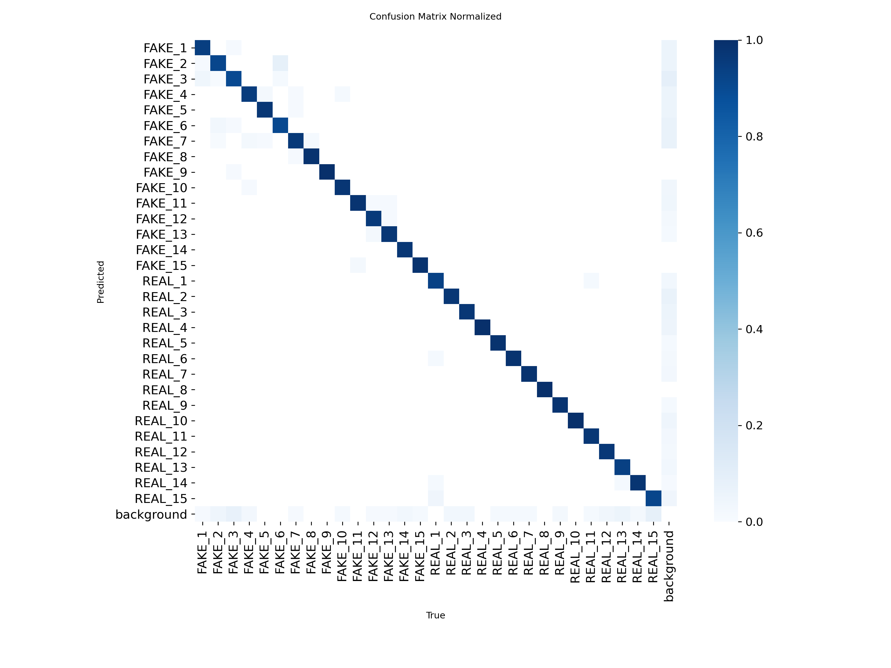

### Precision, Recall, and F1 Curves

| Curve | Plot |
|-------|------|
| Precision-Recall |  |
| Precision | 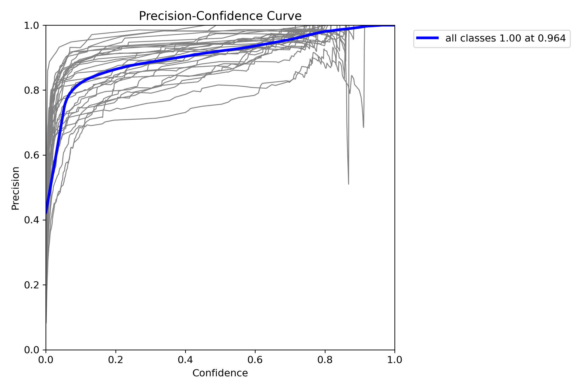 |
| Recall | 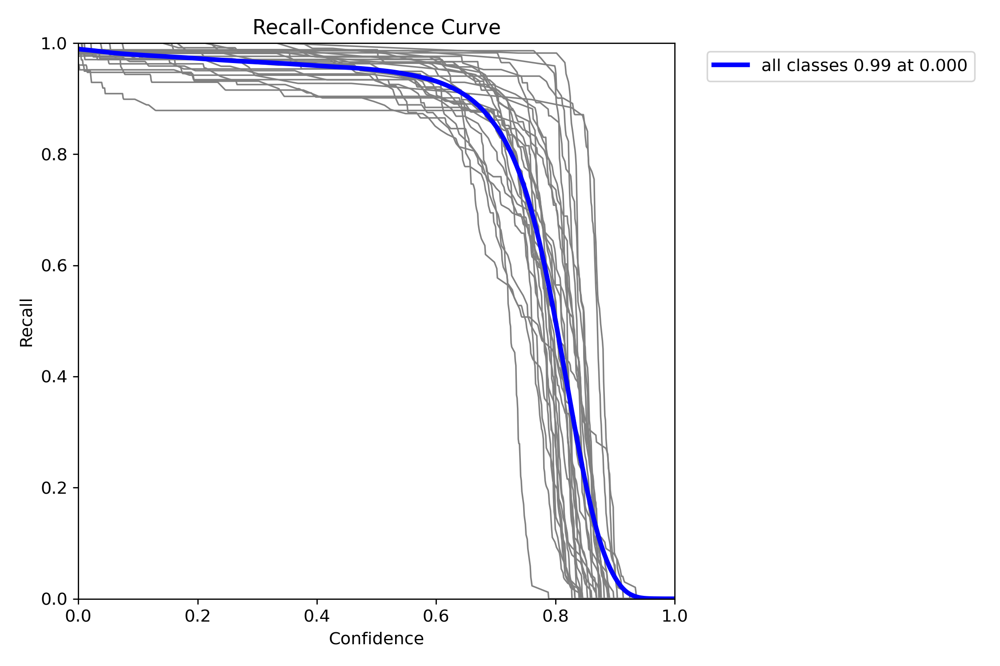 |
| F1 |  |

### Sample Validation Predictions

| Batch | Ground Truth | Predictions |
|-------|-------------|-------------|
| 0 |  |  |
| 1 | 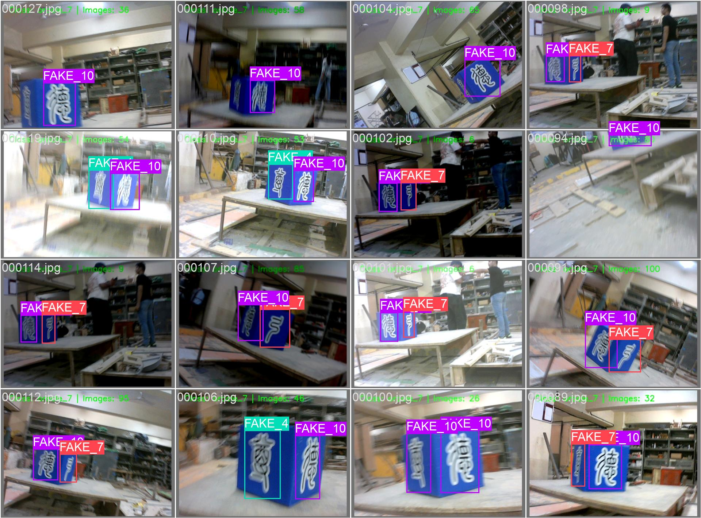 | 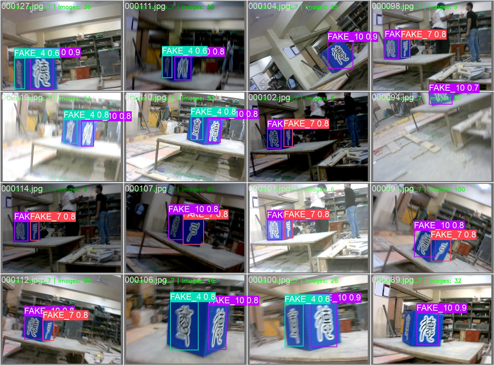 |
| 2 | 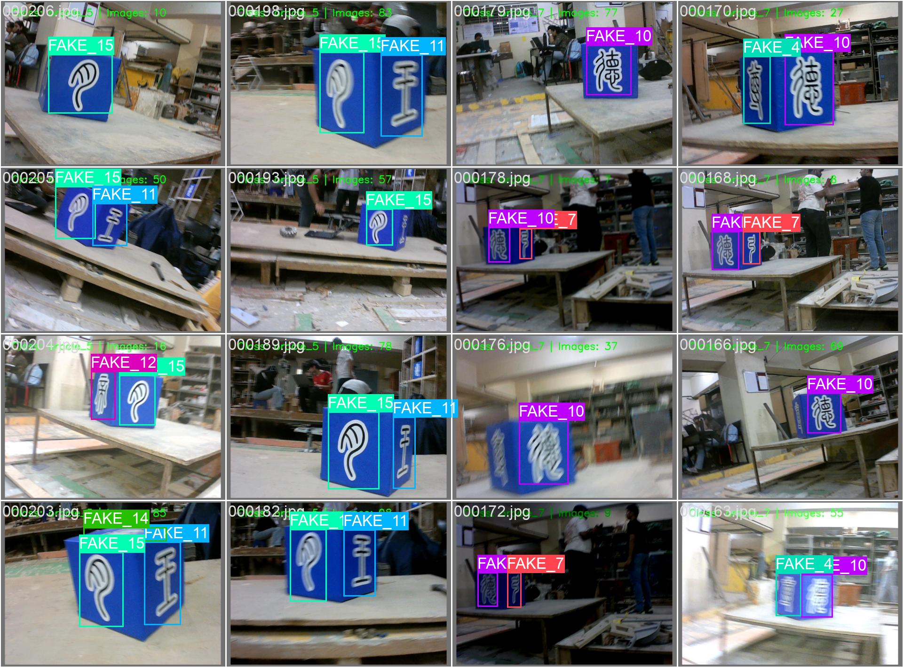 | 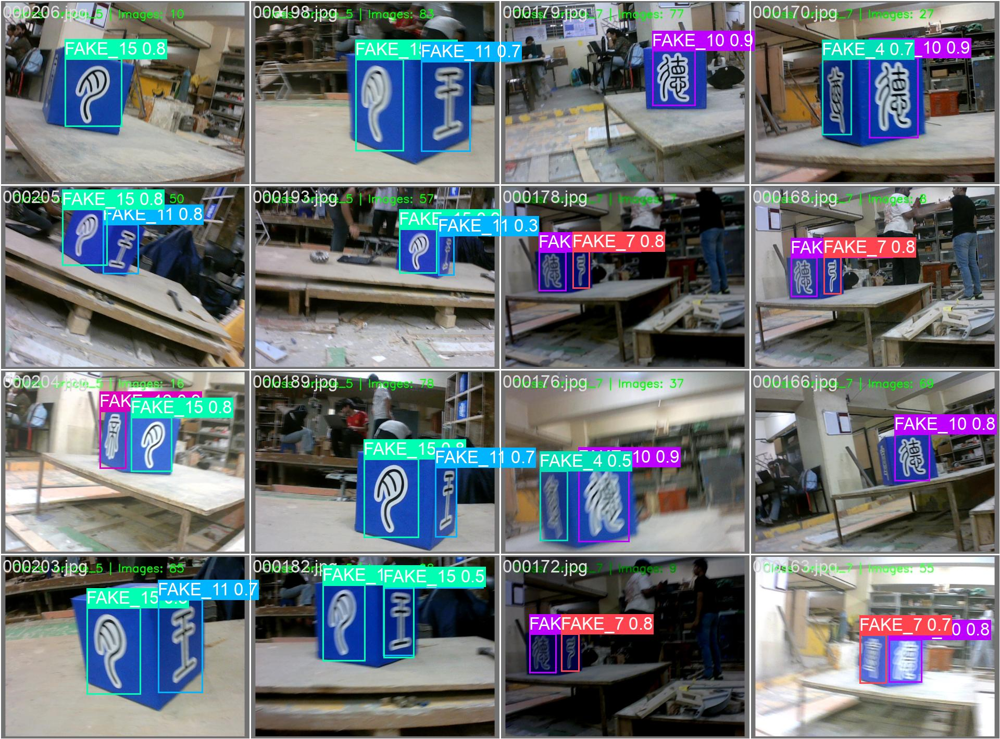 |

---

*[← Back to README](../README.md)*
